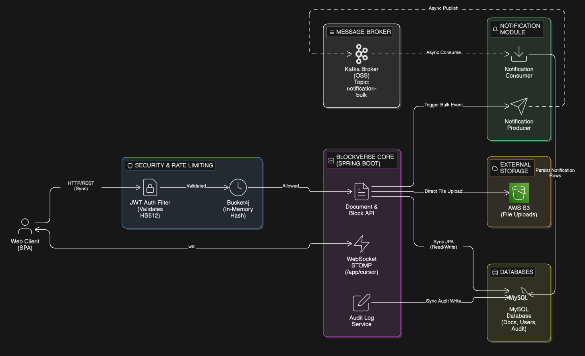

# BlockVerse

> A collaborative, block-based workspace platform — built on Spring Boot 4.




**Layers:**

| Layer | Responsibility |
|---|---|
| Controller | HTTP routing, request binding, response shaping |
| Service | Business logic, auth checks, rate limiting, audit |
| Repository | Spring Data JPA — MySQL (prod) / H2 (test) |
| Security | Stateless JWT filter chain (Spring Security) |
| Messaging | Kafka producer/consumer for async notifications |
| WebSocket | STOMP over WS — real-time cursor, presence, typing |

---

## Tech Stack

| Technology | Version | Rationale |
|---|---|---|
| Spring Boot | 4.0.3 | Latest major; out-of-the-box autoconfiguration |
| Java | 21 (preview) | Virtual threads eligibility, records, pattern matching |
| Spring Security | (boot-managed) | Stateless JWT filter chain; CSRF disabled for SPA compatibility |
| jjwt | 0.12.6 | HS512 access + refresh token pair |
| Spring Data JPA / Hibernate | (boot-managed) | ORM, `@Version` optimistic locking on `Document` |
| MySQL | 8.x (runtime) | Production datastore |
| H2 | runtime (test) | Zero-config in-memory DB for unit/integration tests |
| Apache Kafka | 7.5.3 (Confluent) | Async, decoupled bulk-notification pipeline |
| Spring WebSocket / STOMP | (boot-managed) | Real-time collaboration (cursor, presence, typing) |
| AWS SDK v2 | 2.25.27 | S3 file storage with BOM-managed dependency graph |
| Bucket4j | 8.7.0 | In-process token-bucket rate limiting per user+action |
| ModelMapper | 3.1.1 | DTO↔Entity mapping |
| Lombok | (latest) | Boilerplate elimination |

---

## Quick Start

### Prerequisites

- Java 21+
- Maven 3.9+
- Docker & Docker Compose
- MySQL 8.x running locally **or** update `application.properties` with your DB URL
- AWS credentials (S3 bucket pre-created)

### 1. Start Kafka Infrastructure

```bash
docker-compose up -d
```

This spins up:
- Zookeeper on `:2181`
- Kafka broker on `:9092`

### 2. Configure Environment

Create `src/main/resources/application.properties` (not committed — add your values):

```properties
# DB
spring.datasource.url=jdbc:mysql://localhost:3306/blockverse
spring.datasource.username=<user>
spring.datasource.password=<pass>
spring.jpa.hibernate.ddl-auto=update

# JWT
jwt.secret=<min-64-char-secret>
jwt.accessTokenValidity=900000       # 15 min in ms
jwt.refreshTokenValidity=604800000   # 7 days in ms

# AWS S3
aws.s3.bucket=<bucket-name>
aws.s3.region=<region>
aws.accessKeyId=<key>
aws.secretAccessKey=<secret>

# Kafka
spring.kafka.bootstrap-servers=localhost:9092
```

### 3. Build & Run

```bash
./mvnw spring-boot:run
```

App starts on `http://localhost:8080`.

### 4. Run Tests

```bash
./mvnw test
```

Tests use H2 in-memory DB and an embedded Kafka broker (spring-kafka-test).

---

## API & Component Design

### Base URL

`http://localhost:8080`

### Authentication

All endpoints under `/v1/**` require `Authorization: Bearer <access_token>`.

Public routes: `/v1/auth/**`, `/ws/**`, `/share/**`

### Core Endpoints

#### Auth — `/v1/auth`

| Method | Path | Description |
|---|---|---|
| `POST` | `/register` | Register user → returns access + refresh tokens |
| `POST` | `/login` | Login → returns access + refresh tokens |
| `POST` | `/refresh` | Exchange refresh token → new access token |

#### Workspaces — `/v1/workspaces`

| Method | Path | Description |
|---|---|---|
| `POST` | `/` | Create workspace |
| `GET` | `/{id}` | Get workspace |
| `PUT` | `/{id}` | Update workspace |
| `DELETE` | `/{id}` | Soft-delete workspace |
| `GET` | `/` | List user's workspaces |

#### Workspace Members — `/v1/workspaces/{wsId}/members`

| Method | Path | Description |
|---|---|---|
| `POST` | `/invite` | Invite member (OWNER/ADMIN only) |
| `PUT` | `/{memberId}/role` | Change member role |
| `DELETE` | `/{memberId}` | Remove member |
| `GET` | `/` | List members |

#### Documents — `/v1/workspaces/{wsId}/documents`

| Method | Path | Description |
|---|---|---|
| `POST` | `/` | Create document |
| `GET` | `/{docId}` | Get document metadata |
| `GET` | `/{docId}/blocks` | Get document + all blocks |
| `PUT` | `/{docId}` | Update document title |
| `DELETE` | `/{docId}` | Soft-delete (move to trash) |
| `POST` | `/{docId}/archive` | Archive document |
| `POST` | `/{docId}/unarchive` | Unarchive document |
| `POST` | `/{docId}/restore` | Restore from trash |
| `DELETE` | `/{docId}/permanent` | Permanent delete |
| `POST` | `/{docId}/share` | Create share link with TTL |
| `GET` | `/trash` | List trashed documents |

#### Blocks — `/v1/documents/{docId}/blocks`

| Method | Path | Description |
|---|---|---|
| `POST` | `/` | Create block |
| `PUT` | `/{blockId}` | Update block content/type |
| `DELETE` | `/{blockId}` | Soft-delete block |
| `PUT` | `/{blockId}/move` | Reorder block (position update) |
| `GET` | `/{blockId}/history` | Block change history |

#### Files — `/v1/files`

| Method | Path | Description |
|---|---|---|
| `POST` | `/upload` | Upload file to S3 (5/min rate limit) |

#### Search — `/v1/search`

| Method | Path | Description |
|---|---|---|
| `GET` | `/?keyword=&workspaceId=` | Full-text search across docs + blocks (15/min) |

#### Notifications — `/v1/notifications`

| Method | Path | Description |
|---|---|---|
| `GET` | `/` | All notifications for current user |
| `GET` | `/unread` | Unread only |
| `PUT` | `/{id}/read` | Mark one as read |
| `PUT` | `/read-all` | Mark all as read |

#### Activity Feed — `/v1/workspaces/{wsId}/activity`

| Method | Path | Description |
|---|---|---|
| `GET` | `/` | Paginated audit log for workspace (30/min) |

#### Share (public) — `/share`

| Method | Path | Description |
|---|---|---|
| `GET` | `/{token}` | Access shared document via UUID token (no auth) |

### WebSocket Topics (STOMP)

| Destination | Description |
|---|---|
| `/ws` | WebSocket handshake endpoint |
| `/app/cursor` | Broadcast cursor position |
| `/app/presence` | User join/leave events |
| `/app/typing` | Typing indicator |
| `/topic/document/{id}` | Subscribe to document mutation events |

### Key Domain Models

```
WorkSpace (1) ──< WorkSpaceMember (role: OWNER|ADMIN|MEMBER)
WorkSpace (1) ──< Document (soft-delete + archive + @Version OCC)
Document  (1) ──< Block (self-referential tree, position: BigInteger)
Document  (1) ──< DocumentShare (UUID token, TTL)
Document  (1) ──< BlockChangeLog
Document  (1) ──< AuditLog
User      (1) ──< Notification
```

---

## Project Structure

```
src/main/java/com/blockverse/app/
├── config/          # Kafka, S3, WebSocket config beans
├── controller/      # REST + WebSocket controllers (13 files)
├── dto/             # Request/Response DTOs
├── entity/          # JPA entities (9 files)
├── enums/           # BlockType, WorkSpaceRole, NotificationType, etc.
├── exception/       # Domain exceptions → HTTP status mapping
├── mapper/          # ModelMapper wrappers (DocumentMapper, BlockMapper, …)
├── notification/    # Kafka producer, consumer, NotificationService
├── repo/            # Spring Data JPA repositories
├── security/        # JwtUtil, JwtAuthFilter, WebSecurityConfig, SecurityUtil
└── service/         # Core business logic services
```
